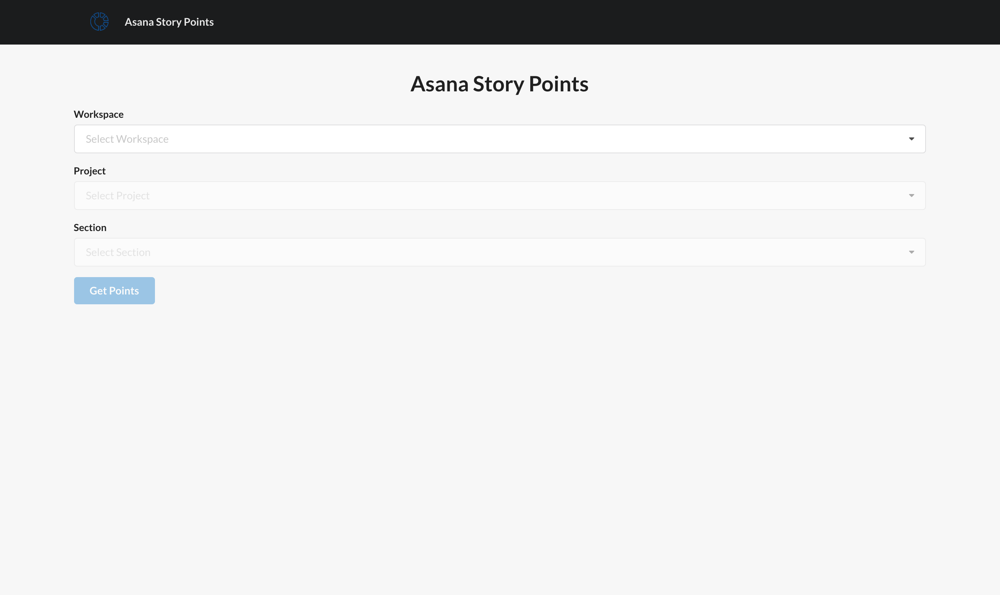

# Asana Story Points
Counts story points assigned to users in a given project section

Built with [React JS](https://reactjs.org) and [Flask Python](https://flask.palletsprojects.com)

## Setup

In the `api` dir:

`cp config.py.example config.py`

Add your Asana Person Access Token to the config (https://developers.asana.com/docs/personal-access-token)
Add the name of the field that holds your story points to the config. This field must be a number field.

## Install

In the `api` dir:

`pip install -r requirements.txt`

In the root dir:

`npm install`

## Run

#### Backend

In the `api` dir:

`flask run`

#### Frontend

In the root dir

`npm run start`
